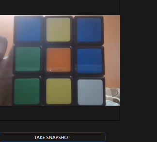

  

# webcube
Rubik's cube assistant on Flask webapp. This webapp accepts the six faces of your cube and gives you the voice instructions as a response.

Demo -> [Link](https://www.linkedin.com/posts/yash-indane-aa6534179_machinelearning-flask-python-activity-6805902901546901507-dN6M)

## Requirements

This webapp requires a lot of extra modules and packages to be downloaded, It is recommanded to follow this order :

```
$ yum install python3 -y
$ yum install gcc-c++ -y
$ yum install python3-devel -y 
$ pip3 install flask 
$ pip3 install Pillow
$ pip3 install numpy
$ pip3 install joblib
$ pip3 install scikit-learn
$ pip3 install scikit-build
$ pip3 install opencv-python
$ yum install opencv opencv-devel opencv-python -y
$ pip3 install kociemba
```

## Usage

This webapp runs on port no. `85` by default, but can be changed in the `app.py` file. To use take edge to edge and centred pics of the cube. 
Start with Red face with the white face down, and take pictures in the order Red -> Green -> Orange -> Blue -> Yellow -> White. After this click `get solution`.



## Working

The six images of six faces have there respective `data_uri`, which are submitted by a form when you click `get solution`. This `data_uri` are converted to images and saved.
Next the function `order` from `order_image.py` renames and creates new images (format example face_0.png to face_5.png), according to images that have central tile colour matching in the order `yellow -> green -> red -> white -> blue -> orange`. Naming images in this order is required for the cube to be solved. A cubestring is formed after predicting the tile colours and getting there respective notations.

```py
colour_mappings = {

    "red": "F",
    "green": "R",
    "blue": "L",
    "yellow": "U",
    "white": "D",
    "orange": "B"
 
}
```

The cubestring is passed to the `kociemba.solve()` function, which return a string containing instructions for solving the cube.
Kociemba is a Python/C implementation of Herbert Kociemba's Two-Phase algorithm for solving Rubik's Cube.

Read full documentation of Kociemba here -> [Link](https://pypi.org/project/kociemba/)

the instructions are decoded to human voice instructions. This instructions are then written to the `output.js` file, which outputs this instructions as voice.

## Building docker image

build docker image by ->

`$ docker build -t <username>/<repo-name>:<version>`

I have also uploded already build image for this webapp on Docker Hub -> [Link](https://hub.docker.com/repository/docker/yashindane/webcube)

## deploying the image in Kubernetes

create a deployment by ->

`$ kubectl create deployment <deploy-name> --image <username>/<repo-name>:<version> `

Scale the deployment if necessary and create a service by ->

`$ kubectl expose deployment <deploy-name> --port=85 --name=<service-name> --type=LoadBalancer`
